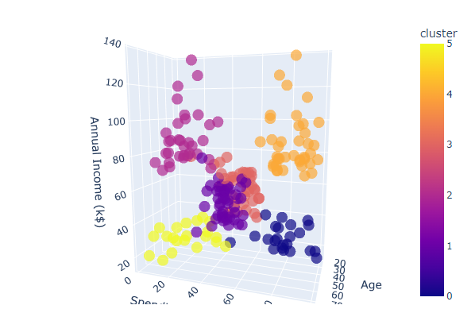

## E-Commerce Customer Segmentation

### Project Overview
* In this project we will perform customer segmentation using different clustering algorithms: K-Means, DBSCAN and Mean Shift.

### Code and Resources Used 
**Python Version:** 3.7  
**Packages:** pandas, numpy, matplotlib, seaborn, plotly, sklearn.

### Dataset
The dataset is taken from The Kaggle Repository (https://www.kaggle.com/datasets/vjchoudhary7/customer-segmentation-tutorial-in-python/data)  

### nbviewer version
* link to notebook with Plotly visualizations enabled:  
https://nbviewer.org/github/facundoriosds/Project-11-E-Commerce-Customer-Segmentation/blob/main/P_11.ipynb

Notebook captures:

