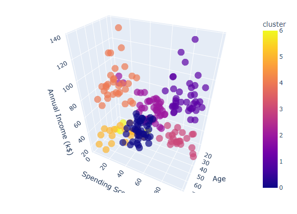

## E-Commerce Customer Segmentation

### Project Overview
* Customer segmentation using K-Means

### Code and Resources Used 
**Python Version:** 3.7  
**Packages:** pandas, numpy, matplotlib, seaborn, sklearn.

### Dataset
The dataset is taken from The Kaggle Repository (https://www.kaggle.com/datasets/vjchoudhary7/customer-segmentation-tutorial-in-python/data)  

